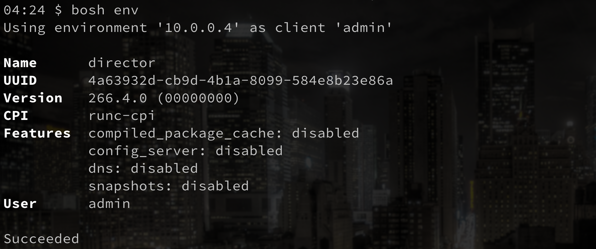

# bosh-runc-cpi-release

The bosh-runc-cpi-release houses a set of tooling intended for the BOSH ecosystem that *orchestrates the creation of containers*, as opposed to VMs. It was inspired by and can most directly be compared to the [warden-cpi-release](https://github.com/cppforlife/bosh-warden-cpi-release). The primary use case is for virtual machine environments where the provisioning of [Garden](https://github.com/cloudfoundry/garden-runc-release) proves prohibitive. It was what powers [blt](https://github.com/aemengo/blt) and [cfdev](https://github.com/cloudfoundry-incubator/cfdev).



## Architecture

Much like the warden-cpi interacts with a garden server, the **runc-cpi** interacts with a **runc-cpi-daemon** counterpart. The cpi itself is a standalone binary that is invoked in the BOSH lifecycle with arguments via stdin. Consequently, the normal workflow is that the daemon is *first* set up listening on a particular `tcp` or `unix` address, *and then* the cpi must be configured with the aforementioned address.

## Daemon

### Prerequisites

- [Golang](https://golang.org): 1.10+
- [RunC](https://github.com/opencontainers/runc): v1.0.0-rc5+
- Tar

### Building

With this repository cloned and all the submodules initialized. Simply compile with Go tooling. Cross-compiling is completely supported:

```bash
$ cd bosh-runc-cpi-release
$ export GOPATH=$PWD
$ export GOARCH=amd64
$ export GOOS=linux
$ go build \
    github.com/aemengo/bosh-runc-cpi/cmd/cpid 
```

### Running

Having the daemon server running is straightfoward. Simply execute the binary built from the previous step with a configuration yaml file and a long running process will be invoked.

Tar and RunC must be on the `$PATH`. Only linux environments are supported. `sudo` privileges are also required.

```bash
# Make sure that tar is on the $PATH
# Make sure that runc is on the $PATH

$ sudo ./cpid ./config.yml
Initializing bosh-runc-cpid...
```

**Note:** In order to support a wide array of use cases, containers created by the bosh-runc-daemon are *privileged*. Running on your host machine is extremely discouraged and at your own risk!  

### config.yml

As of right now, the `./config.yml` file only supports three properties. Here's an example configuration file:

```bash
$ cat config.yml
---
work_dir: "/var/lib/cpid"
network_type: "tcp"
address: "0.0.0.0:9999"
```
- `work_dir:` The location where all bosh state (stemcells, disks, containers) will be kept. If the directory does not exist, it will be created. A directory with high disk space and that can sustain heavy writes is preferred.
- `network_type:` Either `unix` or `tcp`. The protocol type that the daemon will listen as. Since this server must be accessed by both the [director](https://bosh.io/docs/bosh-components/#director) and your bootstrap environment, `tcp` is more flexible and thus supported. `unix` support might be removed in the future.
- `address:` The listen address for the server. With `tcp` it is the form of `<IP>:<PORT>` and with `unix` it is the location of the unix socket. Parent directories will be created if they do not exist. `unix` support might be removed in the future.

## CPI

### Prerequisites

- [Golang](https://golang.org): 1.10+
- [BOSH CLI](https://bosh.io/docs/cli-v2/)

The master branch of this repository keeps an up-to-date reference to a pre-built CPI ready for use with [bosh-deployment](https://github.com/cloudfoundry/bosh-deployment/tree/v1.1.0). To utilize in a the BOSH fashion, simply use the `-o` option to the ops-file at [./operations/runc-cpi.yml](./operations/runc-cpi.yml) and pass in the necessary variables. For example:

```bash
$ cd bosh-runc-cpi-release
$ bosh create-env ../bosh-deployment/bosh.yml \
    -o ./operations/runc-cpi.yml \
    --state ./state.json \
    --vars-store ./creds.yml \
    -v director_name=director \
    -v external_cpid_ip=127.0.0.1 \
    -v internal_cpid_ip=192.168.65.3 \
    -v internal_cpid_gw=192.168.65.1 \
    -v internal_ip=10.0.0.4 \
    -v internal_gw=10.0.0.1 \
    -v internal_cidr=10.0.0.0/16
```

### variables
- `director_name:` Name for your bosh director
- `external_cpid_ip:` Network address of the runc-daemon server used **at bootstrap**. The port of `9999` and network_type of `tcp` is assumed but these can be changed in the ops-file.
- `internal_cpid_ip:` Network address of the runc-daemon server used **by the director** container. The port of `9999` and network_type of `tcp` is assumed but these can be changed in the ops-file.
- `internal_cpid_gw:` A badly named variable. This is the dns resolver address that will be configured with every container. When running inside of VM, you may opt to choose the dns server of the VM itself, otherwise `8.8.8.8` is perfectly valid.
- `internal_ip:` The IP that the bosh director container will be assigned. Your value must fall within the cidr of `10.0.0.0/16` since the runc-daemon server is currently *hardcoded* to use the aforementioned range.
- `internal_gw:` The gateway that will be used by containers in a bridge network. You must specify `10.0.0.1` for this value, since the runc-daemon server is currently *hardcoded* to use the aforementioned value.
- `internal_cidr:` The IP range that container will be assigned. You must specify `10.0.0.0/16` for this value, since the runc-daemon server is currently *hardcoded* to use the aforementioned value.

Due to the current IP restrictions of the runc-daemon, you may opt to use the cloud-config.yml found in this repository at [./operations/cloud-config.yml](./operations/cloud-config.yml) for reference.

**Note:** As of right now, only bosh-deployment [v1.1.0](https://github.com/cloudfoundry/bosh-deployment/tree/v1.1.0) is supported.

### Building

With this repository cloned and all the submodules initialized. Simply compile with Go tooling. Cross-compiling is completely supported.

```bash
$ cd bosh-runc-cpi-release
$ export GOPATH=$PWD
$ export GOARCH=amd64
$ GOOS=linux go build \
    -o ./runc-cpi-linux \
    github.com/aemengo/bosh-runc-cpi/cmd/cpi
$ GOOS=darwin go build \
    -o ./runc-cpi-darwin \
    github.com/aemengo/bosh-runc-cpi/cmd/cpi    
```

To go further and create a BOSH release:

```bash
$ bosh add-blob ./runc-cpi-darwin runc-cpi-darwin
$ bosh add-blob ./runc-cpi-linux runc-cpi-linux
$ bosh create-release --name=bosh-runc-cpi --version=<version> --tarball=<tarball-path>.tgz
```

Then to test your developement bosh-release, you may edit the ops-file at [./operations/runc-cpi.yml](./operations/runc-cpi.yml). You must replace all references of `/releases/-` and `release:` to point to your location and name of your new release, respectively.

Finally you can follow the instructions [here](#CPI) to see it in action.

## License

[Apache 2.0](LICENSE).

Copyright (c) 2018 Anthony Emengo